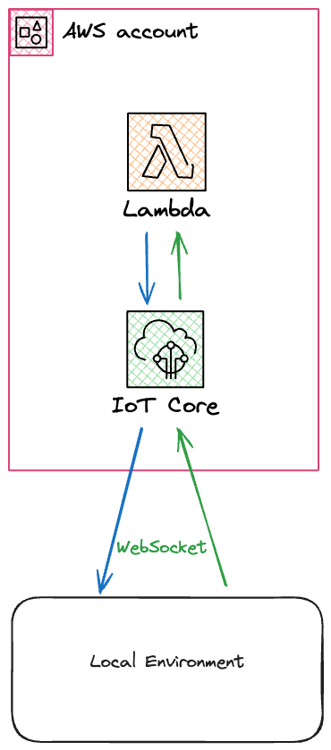

# live-lambda

A powerful development CLI tool designed for local development with AWS Lambda functions. Proxy your lambda function executions directly to your development environment to enable quicker iterations and hot reloading.

## Overview



## Features

- **Live Environment**: Proxy AWS requests to your local machine, supporting live edits of your Lambda Function, while still interacting with other AWS services.
- **Quick Development Cycles**: Instead of waiting for a long CloudFormation deploy, debug your lambda with millisecond latency.

## Installation

Install `live-lambda` globally via npm:

```bash
npm install -g @vendia/live-lambda
```

Or, add it to your project as a development dependency:

```bash
npm install --save-dev @vendia/live-lambda
```

## Usage

After installation, you can use live-lambda in your command line:

```bash
live-lambda [options]
```

## Options

-n, --name: The name of the lambda function to proxy.
-p, --path: The path to the local file to proxy to.
--skip-deploy: Skip deployment of the proxy and restart the websocket listener

-v, --version: Display the version number.
-h, --help: Show help and usage information.

## Examples

Here's a simple example to get you started:

```bash
live-lambda start --name HelloWorldFunction --path lambda/index.js
```

This command will:

1. Replace the lambda function in AWS with a proxy that forwards requests to AWS IOT
2. Starts a websocket listener on your machine with authorization to read from the IOT endpoint
3. Invokes the function at the specified path
4. Returns the response back through IOT, which returns back to the lambda proxy
